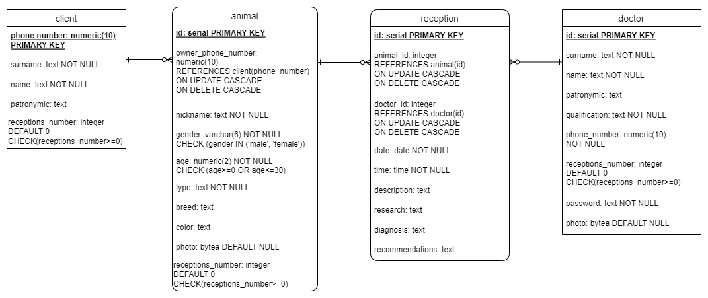

# Схема базы данных:

#Гайд по настройке проекта:
- Через суперпользователя в psql создаем пользователя usr, с паролем 123456, который может создавать таблицы.
  ```
  CREATE USER usr WITH PASSWORD '123456';
  ALTER USER usr CREATEDB;
  ```
 - Авторизуемся с пользователя usr в psql, вставяем в консоль код из файла ```DB.sql```
 - Чтобы запустить проект, надо запустить файл ```db.py```. Чтобы его заполнить данными можно в ```db.py``` поставить значения ```flag=True``` (не забудьте при последующем запуске поставить значение ```flag=False```).
